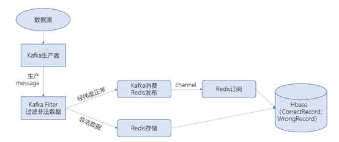
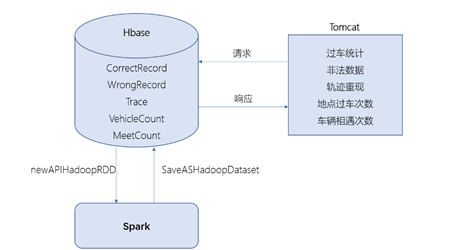
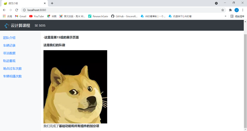
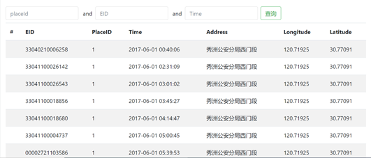
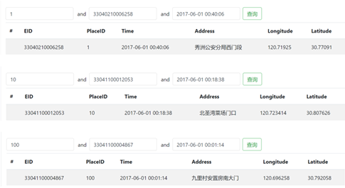
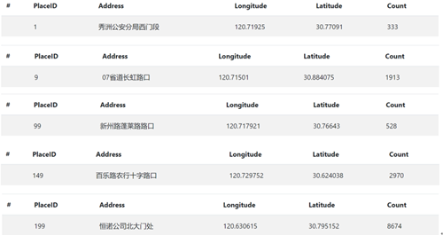
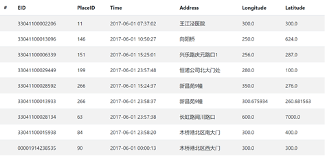
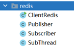
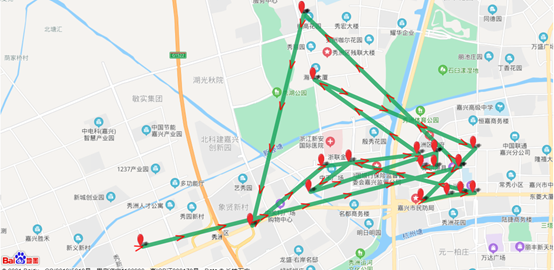
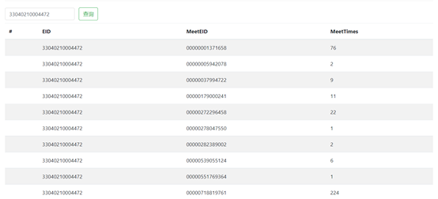

# Urban-vehicle-bigdata

# 0、前言

​	这是云计算技术的大作业

​	项目在老师提供的基础上实现了所有组件的加分项,分别是：

- 数据接入：利用Kafka streams对原始数据进行过滤

- 实时处理：利用Redis实现了基于消息订阅的模式，实现基于Redis的发布订阅功能

- 数据存储：重新编排行键通过用户给定的范围和车辆的电子车牌，重现车辆轨迹，以时间排序

- 数据分析：利用Spark将数据库中的两个数据进行合并返回需要的数据并填入新表中

  首先需要配置好虚拟机、电脑上的hosts文件和程序中的ip地址，基础部分的使用可以参考老师提供的材料

  加分项依次需要运行example下的KafkaFilter类和toTrace类、recordAnalyseSystemSparkCode下的TopN类。
  
  注：该项目使用GPL协议

# 1、系统架构

​	城市车辆智能防控系统是基于物联网、面向服务的计算、云计算和大数据分析等技术构建的一套大数据分析系统，提供车辆记录查询、非法数据过滤及、车辆轨迹重现、车辆相遇次数统计和地点过车次数统计等功能。整个系统本质上是数据接入、数据缓存、数据的持久化、数据分析和功能展示。

​	系统的服务器部署，配置了六台阿里云ECS服务器，系统均为centos6.9，配置为双核GPU和4GB内存。六台均安装zookeeper作为分布式系统可靠协调工具；一台配置Redis和Tomcat负责缓存、发布订阅、解耦和前端展示；两台配置Kafka作为消息中间件并使用Kafka streams过滤掉非法数据，发送到内存数据库Redis中将前后解耦；三台配置Hadoop、HBase和Spark存储、分析数据。

​	同时需要将所有服务器添加至云企业网中，使得不同账号下的虚拟机可以实现内网通信。


# 2、数据流程分析

## 2.1、数据采集过程分析

​	数据采集过程主要涉及的组件有Kafka、Redis和HBase，具体流程如图：




​	各组件具体作用如下：

- Kafka： Kafka生产者将数据发送到特定的topic中，消费者可以在相应的topic消费。使用Kafka Streams实现对数据的过滤，本小组采用HIGH-LEVEL STREAMS DSL方式实现，这种方式下Kafka会创建一个数据流，利用过滤器选择条件对正常数据和非法数据分别处理，在某种意义上属于简单的流式计算。

- Redis： Redis负责消息的缓存，在数据流图中可以看到Kafka的消费者兼任Redis的发布者，对于Kafka过滤后的正确数据直接使用Redis提供的发布订阅功能将数据推送至HBase。在这种方式下Publisher会从jedispool中取出一个连接从相应的频道上推送消息，Subscriber继承JedisPubSub，重写它的方法在订阅、取消订阅、收到消息时调用，同时由于Jedis的subscribe操作是阻塞的，所以另起一个线程来进行subscribe操作，就需要定义一个线程类。

- HBase： HBase负责消息的持久化存储，创建相应的表存储数据。HBase的加分项轨迹需要重新建新表。对于表的设计，由于HBase物理上按列族存储，每个store保存一个列族，若干个store组成一个region，即不同的列族会存储在一个region上，所以当一个列族因为过大需要被切分时可能会影响其他不需要被切分的列族被迫被切分，导致一堆不必要的I/O，当查询被迫被切分的列族数据时需要查询多个region，导致性能降低，所以在满足需求的情况下列族越少越好，所以新表选用一个列族。新表行键为EID，列族只有info，属性为time、latitude、longitude，所以对于同一个EID会存在属性对应多个值，必须更改表的VERSIONS使得表能够存储不同版本的数据，即使用Rowkey、列族、属性和时间戳定位数据。这种方式借助HBase的特性Rowkey插入默认有序会减少获取数据的时间复杂度，即用空间换时间。


## 2.2、数据查询和离线处理分析

​	数据查询和离线处理分析主要涉及到的组件有HBase和Spark，具体流程如图：



- 数据查询：数据查询主要是前端发出请求，HBase返回相应的数据，同时由于有些表的行健中包括多条信息，所以需要在前端对行键进行分解，与查询条件比较获取所需数据在前端展示。

- 离线处理分析：离线处理分析利用Spark组件，SparkContext是所有Spark作业的入口，使用newAPIHadoopRDD读取HBase中的数据，使用mapTopair操作将读取的数据转化为二元组，通过combineByKey进行统计并转化为需要的格式，利用SaveASHadoopDataset将数据保存到HBase中。


# 3、软件功能分析

## 3.1、系统固有功能分析

### 3.1.1、访问Hadoop、HBase、Spark Web界面

​	Hadoop、Hbase、Spark等组件提供可视化界面，分别在浏览器访问相应的端口


### 3.1.2、访问Web系统界面

​	运行Web程序后访问对应端口，如图：




### 3.1.3、根据地点、事件、电子车牌信息查询车辆记录

​	初始页面遍历HBase表中前1000条数据，由于HBase中Rowkey是有序存储而PlaceID在行键的最开头，所以PlaceID为1的数据被展示出来。打开系统界面可以显示前1000条数据，如图：



​	通过Rowkey查询数据，并在前端展示，如图：



### 3.1.4、展示并查询各地点过车次数

​	通过Spark对HBase中存储的数据进行处理，将CorrectRecord表中数据通过newAPIHadoopRDD读取，通过mapTopair将数据转化为二元组，通过聚合函数combineByKey利用读取的数据统计过车次数并将结果转化格式存储至HBase。其中combineByKey包括三个操作，初始化操作、分区内聚合操作和分区间聚合操作。遇到违背处理过的key执行初始化操作，遇到分区内遇到过的key执行分区内聚合操作用于统计数量，分区间聚合操作将不同分区相同key的值进行聚合，最终统计出过车次数。打开相应界面，展示并查询多个地点的过车次数，具体结果如图：




## 3.2、系统附加功能分析

### 3.2.1、数据接入-原始信息过滤

​	数据接入部分加分项为过滤掉非法数据并展示，且在其他结果中不包含错误数据。该功能使用Kafka Streams对原始数据过滤，我们小组采用了HIGH-LEVEL STREAMS DSL方式。这种方式下Kafka会创建一个数据流，利用过滤器选择条件对正常数据和非法数据分别处理，在某种意义上属于简单的流式计算，核心代码如下：

```java
        KStreamBuilder builder = new KStreamBuilder();

        KStream<String, String> stream_1 = builder.stream(topicName);

        System.out.println("handling...");

        stream_1.filter((key, value) ->{

                record = gson.fromJson(value, Record.class);

                if(record.getLongitude()>130 || record.getLatitude()>40)
                    {
                    jedis.sadd(key_wrong,value);
                    return false;
                }
                else
                {
                    jedis.publish("mychannel", value);
//                    System.out.println(value);
                    return true;
                }
            }
    ).to("after");
        System.out.println("ok...");
        KafkaStreams streams = new KafkaStreams(builder, config);
        streams.start();
    }
```

​	可以通过前端页面查看被过滤掉的非法数据：




### 3.2.2、实时处理-数据分发订阅

​	实时处理加分项为使用Redis的发布订阅模式推送数据，这种方式下Publisher会从jedispool中取出一个连接从相应的频道上推送消息，Subscriber继承JedisPubSub，重写它的方法在订阅、取消订阅、收到消息时调用，同时由于Jedis的subscribe操作是阻塞的，所以另起一个线程来进行subscribe操作，就需要定义一个线程类。代码文件结构如图：



​	该功能使用Jedis api实现，Java连接Redis，new一个jedis；获取数据用集合set存储；jsonToObject()将数据转换为对象并存储到列表中，返回对象列表。发布者从jedispool中取出一个连接，从相应的频道上推送消息订阅者，订阅者需要继承JedisPubSub，重写它的三个方法，分别会在订阅，取消订阅，收到消息时调用由于Jedis的subscribe操作是阻塞的，因此，我们另起一个线程来进行subscribe操作，定义一个线程类。从JedisPool获取jedis，通过subscribe的api去订阅，入参是订阅者和频道名。订阅成功并收到消息后订阅者会直接将消息推送给HBase。

​	在实现发布订阅功能中遇到两个问题，第一个是无论云服务器或本地的虚拟机，当发布订阅的消息为5-15万条时会断开与Redis的连接，发布者依旧正常发布但订阅者无法接收到数据，而普通的sadd操作则没有这个问题。通过查阅消息发现Redis的输出缓冲机制为了避免缓冲区消息大量堆积设置了保护机制，对于Pub/Sub客户端大小限制为8M，当缓冲区超过8M时会关闭连接；持续性限制为2M，当缓冲区持续60s超过2M则会关闭客户端连接。

 	其次是Redis发布订阅的速度有时会过慢，在云服务器上发布订阅58万条数据有时约8小时，本地虚拟机同样如此。刚开始考虑本地与虚拟机之间通讯耗时过长于是将程序打成jar包在云服务器运行，问题依然存在；然后考虑是订阅者将数据推至HBase时会请求连接数据库，请求连接耗时过大。


### 3.2.3、数据存储-轨迹重现

​	数据存储的加分项为轨迹查询，通过对CorrectRecord表重新编排行键，读取CorrectRecord表中信息并将行键分解，取出EID作为行键，time、longitude、latitude作为info列族下的属性生成一张新表。在设计新表的过程中考虑到HBase底层架构对表结构的影响，对于表的设计，由于HBase物理上按列族存储，每个store保存一个列族，若干个store组成一个region，即不同的列族会存储在一个region上，所以当一个列族因为过大需要被切分时可能会影响其他不需要被切分的列族被迫被切分，导致一堆不必要的I/O，当查询被迫被切分的列族数据时需要查询多个region，导致性能降低，所以在满足需求的情况下列族越少越好，所以新表选用一个列族。在html文件中调用百度地图api绘制相应的点和路径，具体结果如图：



​	实现该功能的过程中遇到的问题是由于行健、列族、属性相同的值有很多，而HBase创建表时默认不支持多版本，如果又多版本数据传入默认进行覆盖，所以在第一次创建表后发现无法获取到轨迹数据，只有点，经过调试以及查找资料将表的版本定义为最多支持500个版本的数据，将原先的三个参数定位一个值改为四个参数（加上时间戳）定位一个值，问题得到解决。


### 3.2.4、数据分析-相遇次数统计

​	数据分析加分项是统计车辆之间的相遇次数。利用Spark对数据进行处理并新建一张MeetCount表供前端读取展示。整个过程是首先从HBase中取出数据，取出数据后将数据库中的两个数据进行合并，当时间差在60秒之内并且车牌号不相等时返回，将Rowkey设置为eid1+eid2，之后进行combineByKey()。在查询过程中将行键进行分解，提取出eid和相遇的次数。新建表的操作相较于使用笛卡尔积的操作时间复杂度更低，性能更好。

​	前端展示结果如图：



